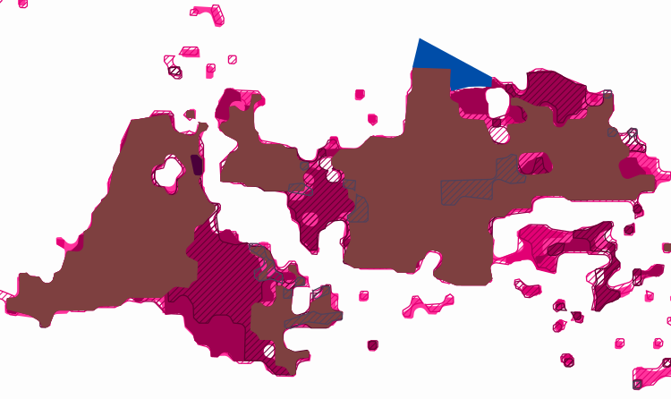

# Breitbandausbaumonitor für Tamm
) 

Archiviert den aktuellen Overlay der [Ausbaukarte](https://t-map.telekom.de/tmap2/coverage_checker/?initLayerGroup=fixedline&initLayerIds=coverage5G,coverageVDSL50,coverageVDSL100,coverageVDSL250,coverageGlasfaser1000,coveragePlanned) der Telekom für Tamm.

## Aktueller Stand

### Legende

## License

Für den Code innerhalb des Repositorys: Apache-2.0

(natürlich nicht für die heruntergeladenen SVGs und die Legende)
