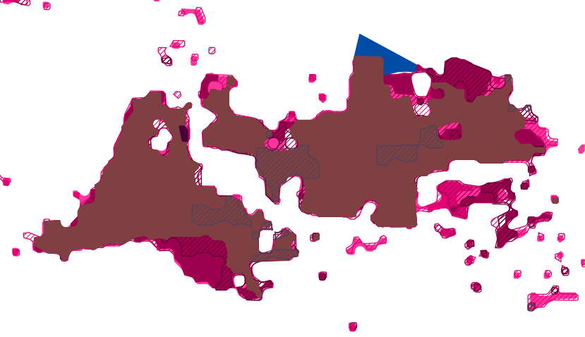
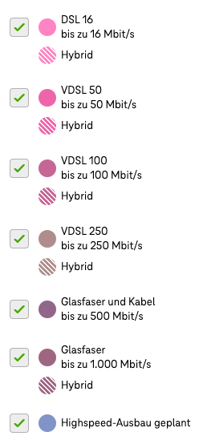
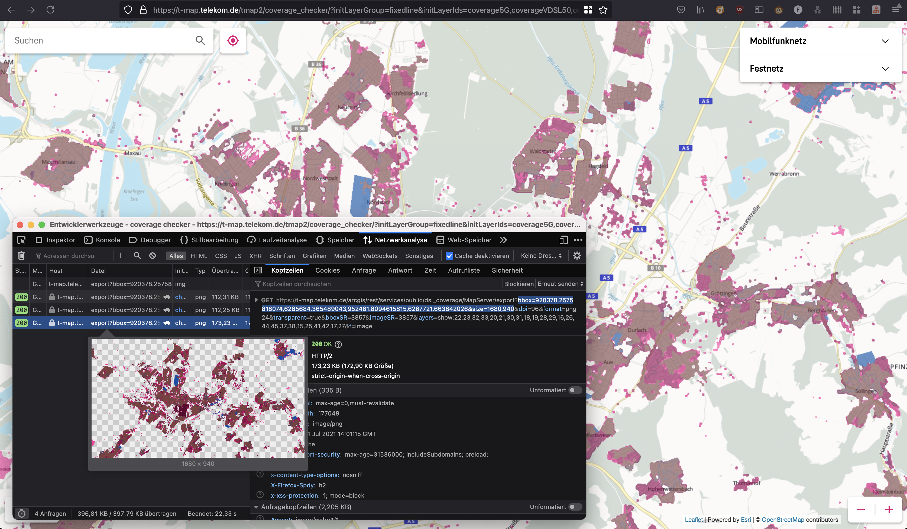

# Breitbandausbaumonitor
[](https://tldrlegal.com/license/apache-license-2.0-(apache-2.0)) <br>
[](https://github.com/chkpnt/Breitbandausbaumonitor/actions)
[](https://github.com/chkpnt/Breitbandausbaumonitor/actions/workflows/update-overlays.yml)
[](https://github.com/chkpnt/Breitbandausbaumonitor/actions/workflows/update-frontend.yml)
[](https://github.com/chkpnt/Breitbandausbaumonitor/actions/workflows/run-tests.yml) <br>
[](https://sonar.chkpnt.de/dashboard?id=breitbandausbaumonitor-archiver)
[](https://sonar.chkpnt.de/dashboard?id=breitbandausbaumonitor-frontend)
<!-- doens't work at the moment: https://github.com/badges/shields/issues/5882 [](https://sonar.chkpnt.de/component_measures?id=breitbandausbaumonitor-archiver&metric=tests&view=list) -->

This project is used to archive the current overlay for landline data transmission technologies of Deutsche Telekom's [coverage map] in specific regions on a daily basis:

- Tamm: since March 14, 2021
- Karlsruhe: since Juli 04, 2021

## Current status
### Tamm


### Karlsruhe


### Legend


## Archiving other regions
Just open a pull request with a new `DownloadCoverageTask` in [build.gradle.kts](build.gradle.kts).

For example, the following task is used to fetch the coverage overlay for _Karlsruhe_:
```kotlin
tasks.register<DownloadCoverageTask>("downloadCoverageForKarlsruhe") {
    region.set("Karlsruhe")
    bbox.set("920378.2575818074,6285684.365489043,952481.8094615815,6267721.663842026")
    size.set("1680,940")
}
```

The required parameters for `bbox` (_Bounding Box_) and `size` can be determined from the corresponding request when viewing the 
the [coverage map]:



Please do not try to cover too large areas, as the file size of the downloaded SVG grows quickly.

## License

For the source code within this repository: Apache-2.0

(of course not for the archived SVGs and the legend)

[coverage map]: https://t-map.telekom.de/tmap2/coverage_checker/?initLayerGroup=fixedline&initLayerIds=coverage5G,coverageVDSL50,coverageVDSL100,coverageVDSL250,coverageGlasfaser1000,coveragePlanned