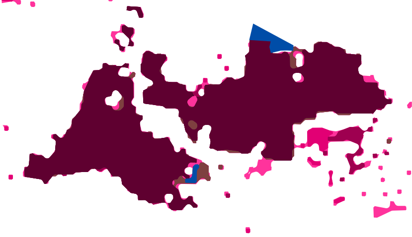

# Breitbandausbaumonitor
[](https://tldrlegal.com/license/apache-license-2.0-(apache-2.0)) 
[](https://github.com/chkpnt/Breitbandausbaumonitor/actions/workflows/update-coverage.yml)

Archiviert den aktuellen Overlay der [Ausbaukarte] der Telekom für bestimmte Regionen:

- Tamm: seit 14.03.2021
- Karlsruhe: seit 04.07.2021

## Aktueller Stand
### Tamm


### Karlsruhe


### Legende


## Archivierung weiterer Regionen
Wenn Du eine weitere Region archiviert haben möchtest, sende mir einfach einen Pull-Request mit einem neuen `DownloadCoverageTask` in der [build.gradle.kts](build.gradle.kts).

Für Karlsruhe ist beispielsweise folgender Task definiert:
```kotlin
tasks.register<DownloadCoverageTask>("downloadCoverageForKarlsruhe") {
    region.set("Karlsruhe")
    bbox.set("920378.2575818074,6285684.365489043,952481.8094615815,6267721.663842026")
    size.set("1680,940")
}
```

Die benötigten Parameter für `bbox` (_Bounding Box_) und `size` kannst Du aus dem entsprechenden Request beim Anschauen 
der [Ausbaukarte] ermitteln:


## Lizenz

Für den Code innerhalb des Repositorys: Apache-2.0

(natürlich nicht für die heruntergeladenen SVGs und die Legende)

[Ausbaukarte]: https://t-map.telekom.de/tmap2/coverage_checker/?initLayerGroup=fixedline&initLayerIds=coverage5G,coverageVDSL50,coverageVDSL100,coverageVDSL250,coverageGlasfaser1000,coveragePlanned